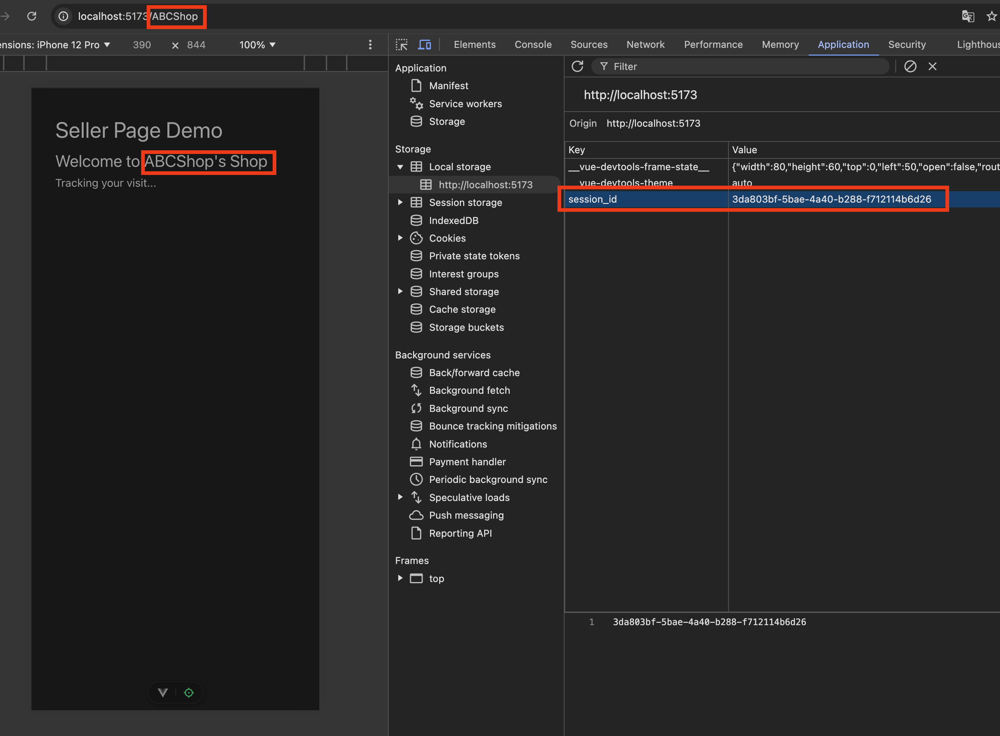
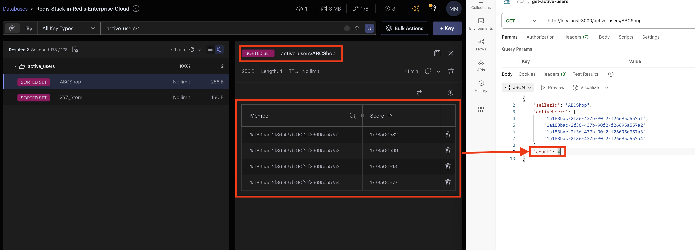
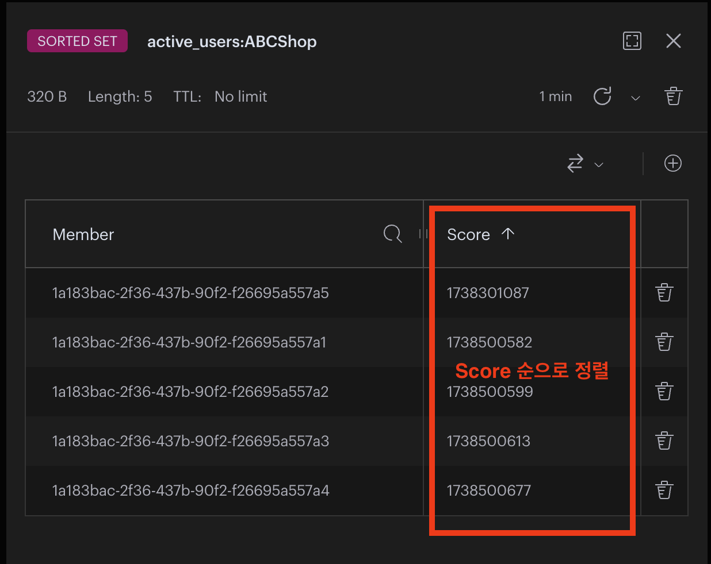

# live-user-monitor

## backend

- 사전요구사항: .env.base 파일을 복사해 backend/.env 파일을 생성하고 REDIS 접속정보 추가

```bash
cd backend
npm install
npm run dev
```

## frontend

```bash
cd frontend
npm install
npm run dev
```

## 테스트

- `http://localhost:5173/:sellerId` (샘플: http://localhost:5173/ABCShop)로 접속



- `http://localhost:5173/active-users/:sellerId` 명령어로 최근 30분 접속자 확인



## ZSET

- ZSET 특징: 집합의 멤버들이 Score순으로 자동 정렬
- O(log N + M) → 탐색(log N) + 삭제 개수(M)의 효율적인 시간복잡도로 멤버를 삭제할 수 있음


